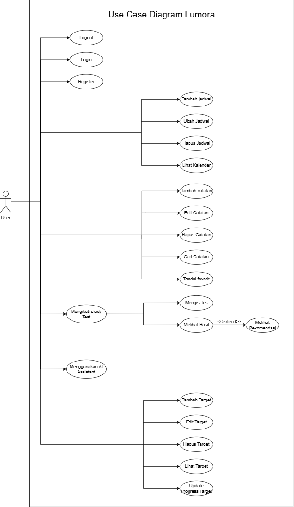
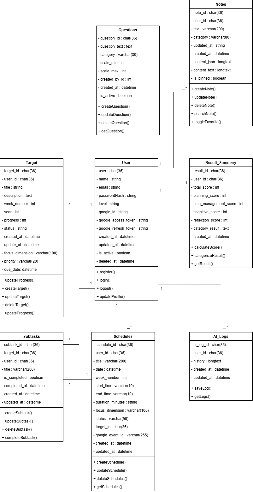
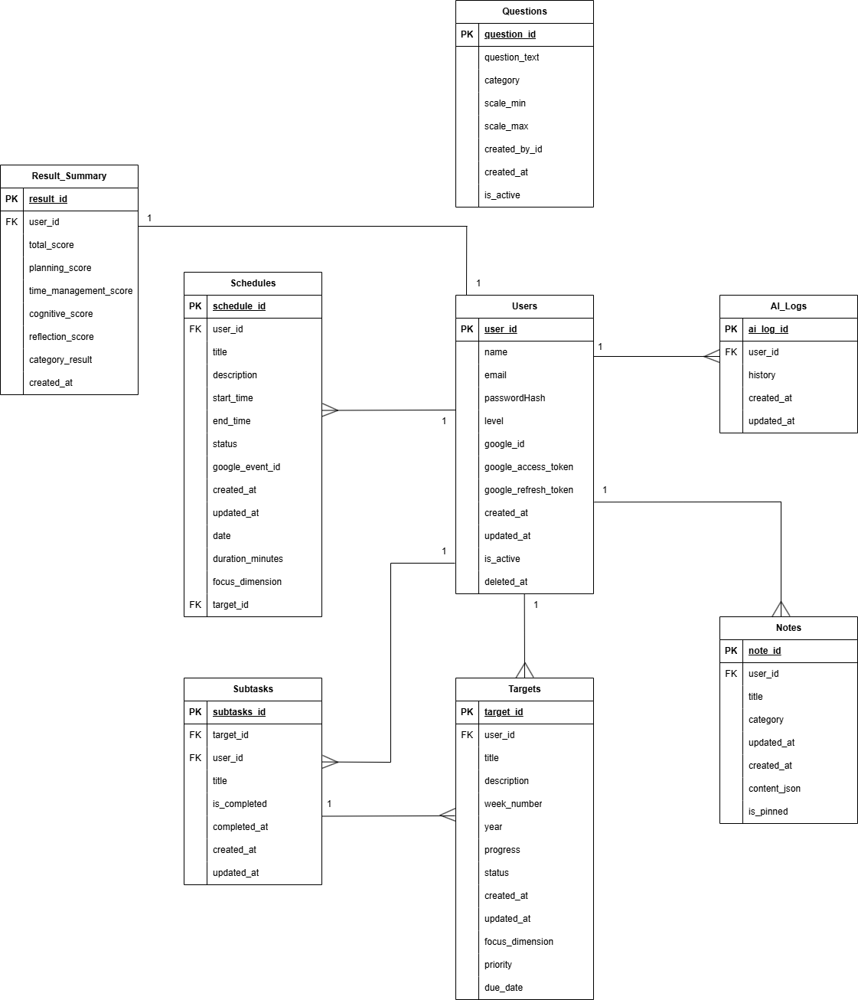

# Lumora

| Layer       | Technology                                 |
| ----------- | ------------------------------------------ |
| Backend     | Go (Gin Framework)                         |
| Web App     | Vue.js (VILT Stack: Vue, Inertia, Laravel) |
| Mobile App  | React Native (Expo)                        |
| Database    | MySQL (GORM)                               |
| AI Service  | OpenRouter API (Agentic Function Calling)  |
| Auth        | Token-based Authentication (JWT)           |
| Testing     | Postman                                    |

## System Architecture

### Use Case Diagram


**Actors:**

- User (Mahasiswa / Pelajar)

### Class Diagram


### Entity Relationship Diagram (ERD)


## API Documentation

### Base URL
```
http://localhost:8008/api
```

### Authentication

#### Register
* **Endpoint:** POST /auth/register => `http://localhost:8008/api/auth/register`
* **Deskripsi:** Digunakan untuk mendaftarkan akun pengguna baru ke dalam sistem.
* **Request:**
  ```json
  {
    "name": "Mahasiswa",
    "email": "mahasiswa@example.com",
    "password": "password123",
    "password_confirmation": "password123"
  }
  ```
* **Response:**
  ```json
  {
    "success": true,
    "message": "User created successfully"
  }
  ```
* **Screenshot:**
  

#### Login
* **Endpoint:** POST /auth/login => `http://localhost:8008/api/auth/login`
* **Deskripsi:** Digunakan untuk melakukan login user dan mendapatkan token JWT untuk autentikasi.
* **Request:**
  ```json
  {
    "email": "mahasiswa@example.com",
    "password": "password123"
  }
  ```
* **Response:**
  ```json
  {
    "success": true,
    "message": "Login successful",
    "data": {
      "token": "eyJhbGciOiJIUzI1NiIsIn..."
    }
  }
  ```
* **Screenshot:**
  

#### Get Current User
* **Endpoint:** GET /auth/me => `http://localhost:8008/api/auth/me`
* **Deskripsi:** Digunakan untuk mendapatkan data profil pengguna yang sedang login.
* **Header:** `Authorization: Bearer <token>`
* **Response:**
  ```json
  {
    "success": true,
    "data": {
      "user_id": "uuid-1234",
      "name": "Mahasiswa",
      "email": "mahasiswa@example.com",
      "role": "student"
    }
  }
  ```
* **Screenshot:**
  

### AI Service (Lumora Buddy)

#### Chat with AI
* **Endpoint:** POST /assessment/chat => `http://localhost:8008/api/assessment/chat`
* **Deskripsi:** Digunakan untuk mengirim pesan ke Lumora Buddy. AI akan secara dinamis membaca profil belajar dan memanggil JSON Action untuk membuat jadwal atau target otomatis.
* **Header:** `Authorization: Bearer <token>`
* **Request:**
  ```json
  {
    "message": "Buatkan saya target belajar matematika untuk minggu ini"
  }
  ```
* **Response:**
  ```json
  {
    "success": true,
    "message": "Success",
    "reply": "Siap! Aku sudah buatkan target mingguan untuk Matematika.\n{\"action\": \"create_target\", \"title\": \"Belajar Matematika\", \"due_date\": \"2026-10-20\"}"
  }
  ```
* **Screenshot:**
  

#### Get Chat History
* **Endpoint:** GET /assessment/chat/history => `http://localhost:8008/api/assessment/chat/history`
* **Deskripsi:** Digunakan untuk mengambil riwayat percakapan dengan Lumora Buddy.
* **Header:** `Authorization: Bearer <token>`
* **Response:**
  ```json
  {
    "success": true,
    "data": [
      {
        "role": "user",
        "content": "Buatkan saya target belajar matematika untuk minggu ini"
      },
      {
        "role": "bot",
        "content": "Siap! Aku sudah buatkan target mingguan untuk Matematika..."
      }
    ]
  }
  ```
* **Screenshot:**
  

### Planner & Google Calendar

#### Get Planner
* **Endpoint:** GET /dashboard/planner => `http://localhost:8008/api/dashboard/planner`
* **Deskripsi:** Digunakan untuk mengambil daftar jadwal harian pengguna.
* **Header:** `Authorization: Bearer <token>`
* **Response:**
  ```json
  {
    "success": true,
    "data": [
      {
        "id": 1,
        "title": "Belajar Matematika",
        "date": "2026-10-15",
        "start_time": "20:00",
        "end_time": "21:30"
      }
    ]
  }
  ```
* **Screenshot:**
  

#### Create Planner
* **Endpoint:** POST /dashboard/planner => `http://localhost:8008/api/dashboard/planner`
* **Deskripsi:** Digunakan untuk menambahkan jadwal studi baru. **Catatan:** Jika akun pengguna telah terhubung, sistem akan otomatis melakukan *sync* jadwal ini ke Google Calendar di balik layar tanpa perlu memanggil endpoint tambahan.
* **Header:** `Authorization: Bearer <token>`
* **Request:**
  ```json
  {
    "title": "Latihan Fisika",
    "date": "2026-10-16",
    "start_time": "19:00",
    "end_time": "20:30",
    "description": "Latihan soal mekanika"
  }
  ```
* **Response:**
  ```json
  {
    "success": true,
    "message": "Planner created successfully"
  }
  ```
* **Screenshot:**
  

### Targets & Goals

#### Get Targets
* **Endpoint:** GET /dashboard/weekly-targets => `http://localhost:8008/api/dashboard/weekly-targets`
* **Deskripsi:** Mengambil semua target mingguan pengguna.
* **Header:** `Authorization: Bearer <token>`
* **Response:**
  ```json
  {
    "success": true,
    "data": [
      {
        "id": 1,
        "title": "Selesaikan Bab 3",
        "due_date": "2026-10-20",
        "is_completed": false
      }
    ]
  }
  ```
* **Screenshot:**
  

#### Create Target
* **Endpoint:** POST /dashboard/weekly-targets => `http://localhost:8008/api/dashboard/weekly-targets`
* **Deskripsi:** Menambahkan target mingguan baru.
* **Header:** `Authorization: Bearer <token>`
* **Request:**
  ```json
  {
    "title": "Membaca Jurnal Ilmiah",
    "due_date": "2026-10-22"
  }
  ```
* **Response:**
  ```json
  {
    "success": true,
    "message": "Target created successfully"
  }
  ```
* **Screenshot:**
  

#### Update Target
* **Endpoint:** PUT /dashboard/weekly-targets/:id => `http://localhost:8008/api/dashboard/weekly-targets/1`
* **Deskripsi:** Mengubah detail target, seperti mengganti judul atau batas waktu.
* **Header:** `Authorization: Bearer <token>`
* **Response:**
  ```json
  {
    "success": true,
    "message": "Target status updated"
  }
  ```
* **Screenshot:**
  

### Notes Management

#### Get Notes
* **Endpoint:** GET /dashboard/notes => `http://localhost:8008/api/dashboard/notes`
* **Deskripsi:** Mengambil semua catatan studi pengguna.
* **Header:** `Authorization: Bearer <token>`
* **Response:**
  ```json
  {
    "success": true,
    "data": [
      {
        "id": 1,
        "title": "Ringkasan Bab 1",
        "content": "Inti dari bab 1 adalah..."
      }
    ]
  }
  ```
* **Screenshot:**
  

#### Create Note
* **Endpoint:** POST /dashboard/notes => `http://localhost:8008/api/dashboard/notes`
* **Deskripsi:** Menambahkan catatan studi baru.
* **Header:** `Authorization: Bearer <token>`
* **Request:**
  ```json
  {
    "title": "Ide Proyek",
    "content": "Buat aplikasi manajemen waktu"
  }
  ```
* **Response:**
  ```json
  {
    "success": true,
    "message": "Note created successfully"
  }
  ```
* **Screenshot:**
  

### Assessment (SRL Profile)

#### Get Assessment Questions
* **Endpoint:** GET /assessment/questions => `http://localhost:8008/api/assessment/questions`
* **Deskripsi:** Mengambil daftar pertanyaan kuesioner yang harus dijawab oleh pengguna untuk menentukan profil belajar mereka (memuat UUID tiap pertanyaan yang dibutuhkan saat *submit*).
* **Header:** `Authorization: Bearer <token>`
* **Response:**
  ```json
  {
    "success": true,
    "message": "Success",
    "data": [
      {
        "id": "11111111-0001-0001-0001-000000000001",
        "text": "Saya merencanakan apa yang ingin saya capai sebelum mulai belajar.",
        "category": "planning"
      }
    ]
  }
  ```
* **Screenshot:**
  

#### Submit Assessment
* **Endpoint:** POST /assessment/submit => `http://localhost:8008/api/assessment/submit`
* **Deskripsi:** Mengirim jawaban kuesioner Self-Regulated Learning (SRL) untuk menghitung profil belajar pengguna.
* **Header:** `Authorization: Bearer <token>`
* **Request:**
  ```json
  [
    {
      "question_id": "Q1",
      "answer_value": 4
    },
    {
      "question_id": "Q2",
      "answer_value": 5
    },
    {
      "question_id": "Q3",
      "answer_value": 3
    }
  ]
  ```
* **Response:**
  ```json
  {
    "success": true,
    "message": "Assessment submitted successfully",
    "data": {
      "ResultID": "5609cff9-...",
      "TotalScore": 12,
      "PlanningScore": 12,
      "CategoryResult": "{...}"
    }
  }
  ```
* **Screenshot:**
  

#### Get Assessment Status
* **Endpoint:** GET /assessment/status => `http://localhost:8008/api/assessment/status`
* **Deskripsi:** Mengecek apakah pengguna sudah pernah mengisi kuesioner atau belum.
* **Header:** `Authorization: Bearer <token>`
* **Response:**
  ```json
  {
    "success": true,
    "message": "Status fetched",
    "data": {
      "has_completed": true
    }
  }
  ```
* **Screenshot:**
  

---

**Documentation Report (LO3)**

**Deskripsi Sistem**

Lumora adalah platform pendamping belajar berbasis web dan mobile yang dirancang untuk membantu mahasiswa dan pelajar mengelola proses pembelajaran mandiri (Self-Regulated Learning) dengan memanfaatkan teknologi Agentic Artificial Intelligence (AI).

Sistem ini memungkinkan pengguna untuk mengelola target mingguan, menyusun jadwal harian secara otomatis melalui obrolan dengan AI, mencatat materi penting, serta memantau progres belajar secara terstruktur dan efisien.

---

**Tujuan Sistem**

Tujuan dari sistem Lumora adalah:

- Mempercepat proses penyusunan jadwal belajar dengan bantuan fungsi otomatisasi AI
- Meningkatkan efisiensi pengelolaan waktu pengguna melalui sinkronisasi kalender terintegrasi
- Membantu pengguna dalam mempertahankan fokus dan motivasi melalui target harian
- Menyediakan sistem evaluasi dan pemantauan gaya belajar melalui kuesioner terstruktur

---

**Workflow Sistem Lumora (Berdasarkan Role)**

Workflow sistem Lumora difokuskan pada pengguna utama (pelajar/mahasiswa) untuk memastikan seluruh proses berjalan sesuai dengan kebutuhan pengelolaan waktu mereka.

---

**User (Student)**

1. Student melakukan registrasi akun ke sistem
2. Student melakukan login ke sistem
3. Student mengisi kuesioner awal (Onboarding) untuk penentuan profil belajar
4. Student berinteraksi dengan AI (Lumora Buddy) untuk meminta saran target mingguan atau harian
5. Student menerima jadwal yang dibuat secara otomatis oleh AI di halaman Planner
6. Student menyinkronkan jadwal belajarnya dengan Google Calendar
7. Student menandai tugas yang sudah selesai pada halaman Targets
8. Student mencatat rangkuman pelajaran pada fitur Notes
9. Student logout dari sistem

---

**AI System (External Service)**

1. Sistem menerima pesan chat dari Student
2. Sistem menyusun context prompt berdasarkan profil belajar dan jadwal harian Student
3. Sistem mengirim prompt ke layanan OpenRouter API
4. AI memproses konteks dan menghasilkan respon percakapan beserta JSON Action
5. Sistem menerima respon, membersihkan format, dan mengeksekusi JSON Action ke database

---

**Teknologi yang Digunakan**

- Web Frontend: Vue.js (VILT Stack: Vue, Inertia, Laravel)
- Mobile App: React Native (Expo)
- Backend: Go (Gin Framework)
- Database: MySQL (GORM)
- AI Service: OpenRouter API (Agentic Function Calling)
- Authentication: Token-based authentication (JWT)
- API Testing: Postman

---

**Security**

- Token-based authentication (JWT) digunakan untuk mengamankan setiap endpoint lintas platform
- Password dienkripsi dengan algoritma bcrypt sebelum disimpan ke database
- Validasi ketat pada setiap permintaan API untuk mencegah penyalahgunaan data

---

**Keunggulan Sistem**

- Tersedia di dua platform (Web dan Mobile) yang tersinkronisasi secara real-time
- Terintegrasi dengan Agentic AI cerdas yang memiliki memori kontekstual (Context Injection)
- AI mampu mengeksekusi aksi otomatis (Function Calling) tanpa intervensi manual
- UI/UX yang dinamis, modern, dan sangat responsif

---

**Keterbatasan Sistem**

- Fitur AI membutuhkan koneksi internet yang stabil untuk mengakses OpenRouter API
- Saat ini baru mendukung integrasi kalender eksklusif hanya untuk Google Calendar
- AI kadang membutuhkan waktu beberapa detik untuk men-generate respon dan aksi

---

**Pengembangan Selanjutnya**

- Penambahan fitur notifikasi dan pengingat push (Push Notifications) di Mobile App
- Dukungan integrasi ke platform kalender lain seperti Apple Calendar atau Outlook
- Fitur kolaborasi belajar bersama teman secara berkelompok
- Peningkatan akurasi LLM untuk bahasa yang lebih natural dan pemahaman konteks emosional

---
